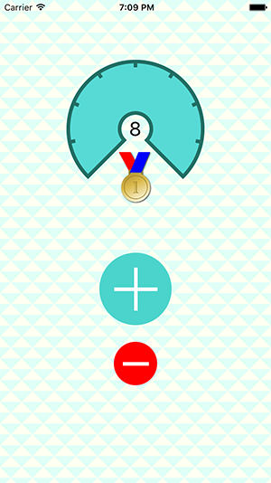

# Flo-App

Flo Core Graphics Tutorial at : http://www.raywenderlich.com/90690/modern-core-graphics-with-swift-part-1

I did this tutorial to get to grips with Core Graphics better. Code converted from Swift to Objective-C. Hopefully others who work in Objective-C will find it useful.

It is possible to use IBInspectables in Objective-C however default values cannot be set. Even if you set them in initWithCoder:(NSCoder *)coder they won’t show in the interface builder. It is better just to set them in the interface builder (i.e. not choosing default and choosing a value or color).

App contains test data for 7 days and it doesn’t actually save the data for the current day either. The app is just meant to demonstrate Core Graphics’ capabilities.

Optimised for iOS8+, iPhone5 - iphone6S+

